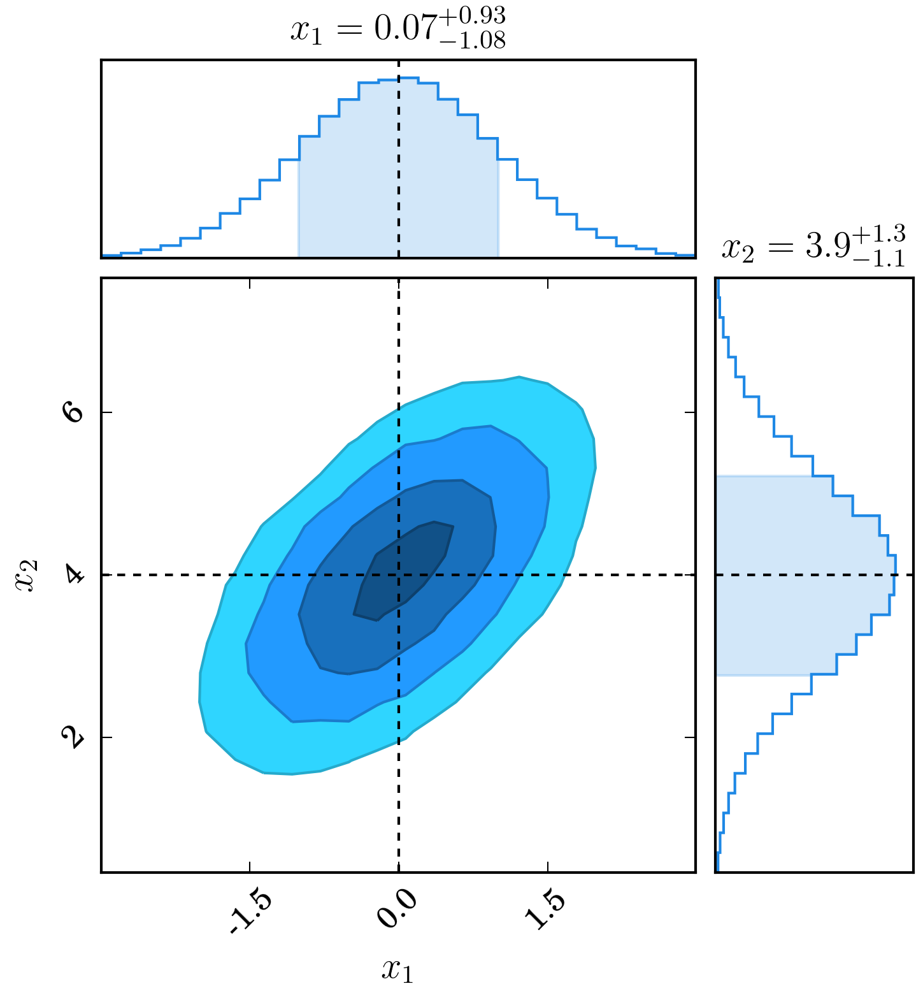

.. _chain:

==============
Chain Consumer
==============

I wrote this code after realising that the fantastic library
`corner <https://github.com/dfm/corner.py>`_ could not plot everything I
wanted to plot. And so here we are!

.. literalinclude:: ../dessn/chain/examples/demo_introduction.py
   :language: python

The output figure is displayed below.

For examples and API usage, please follow the links.

.. toctree::
   :maxdepth: 2

   chain_examples
   chain_api

For convenience, images of the examples are provided here, with click
through links on each image.

.. raw:: html

   

.. image:: ../dessn/chain/examples/demoOneChain.png
   :width: 32%
   :target: chain_examples.html#single-chain-example

.. image:: ../dessn/chain/examples/demoTwoDisjointChains.png
   :width: 32%
   :target: chain_examples.html#two-disjoint-chains-example

.. image:: ../dessn/chain/examples/demoThreeChains.png
   :width: 32%
   :target: chain_examples.html#three-datasets

.. image:: ../dessn/chain/examples/demoWalks.png
   :width: 32%
   :target: chain_examples.html#plotting-walks

.. image:: ../dessn/chain/examples/demoVarious1_NoHist.png
   :width: 32%
   :target: chain_examples.html#no-histograms

.. image:: ../dessn/chain/examples/demoVarious2_SelectParameters.png
   :width: 32%
   :target: chain_examples.html#parameter-subsets

.. image:: ../dessn/chain/examples/demoVarious3_Flip.png
   :width: 32%
   :target: chain_examples.html#stop-plot-flipping-and-changing-ticks

.. image:: ../dessn/chain/examples/demoVarious4_ForceSummary.png
   :width: 32%
   :target: chain_examples.html#disable-summary-sigma-levels-and-point-clouds

.. image:: ../dessn/chain/examples/demoVarious5_CustomColours.png
   :width: 32%
   :target: chain_examples.htmll#custom-colours-and-forcing-shading

.. image:: ../dessn/chain/examples/demoVarious6_TruthValues.png
   :width: 32%W
   :target: chain_examples.html#truth-values

.. image:: ../dessn/chain/examples/demoVarious7_Rainbow.png
   :width: 32%
   :target: chain_examples.html#custom-bins-and-sans-serif-font

.. image:: ../dessn/chain/examples/demoVarious8_Extents.png
   :width: 32%
   :target: chain_examples.html#custom-extents

.. image:: ../dessn/chain/examples/demoVarious9_kde.png
   :width: 32%
   :target: chain_examples.html#gaussian-kde

.. image:: ../dessn/chain/examples/demoTable.png
   :width: 32%
   :target: chain_examples.html#a-latex-table

.. raw:: html

   
