.. _chain_examples:

=======================
Chain Consumer Examples
=======================

Single Chain Example
--------------------

Running this file in python creates a random data set, representing a single MCMC chain,
such as you might get from ``emcee``.

The first thing we do is create a consumer, and load the chain into it.

We also supply the parameter labels. By default, as we only have a single chain,
contours are filled, the marginalised histograms are shaded, the best fit
parameter bounds are shown as axis titles, and the legend is not displayed.

.. literalinclude:: ../dessn/chain/examples/demoOneChain.py
   :language: python

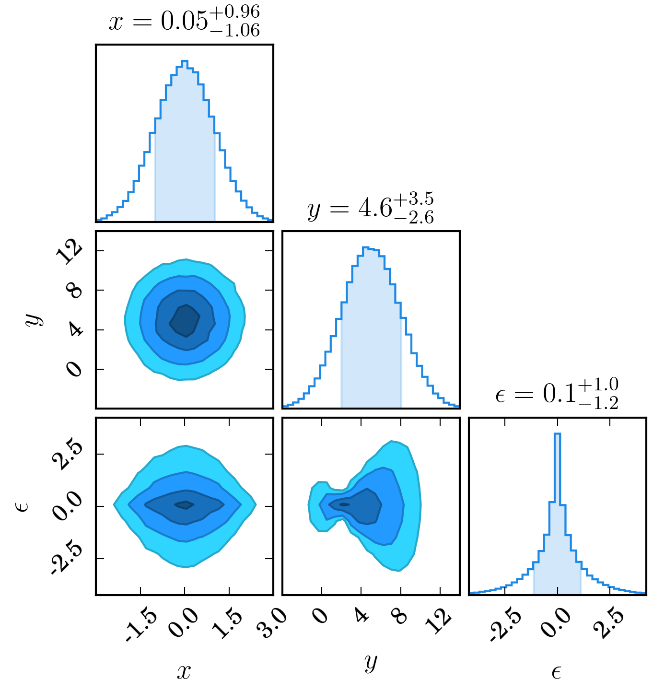

Two Disjoint Chains Example
---------------------------

Running this file in python creates two random data sets, representing two separate
chains, *for two separate models*.

It is sometimes the case that we wish to compare models which have partially
overlapping parameters. For example, we might fit a framework which depends
has cosmology dependent on :math:`\Omega_m` and :math:`\Omega_\Lambda`, where we
assume :math:`w = 1`. Alternatively, we might assume flatness, and therefore
fix :math:`\Omega_\Lambda` but instead vary the equation of state :math:`w`.
The good news is, you can visualise them both at once!

As we have different parameters for each chain we supply the right parameters
for each chain. Also note that we set ``display=True`` when plotting,
so the plot will also pop up if any backend is enabled.

.. literalinclude:: ../dessn/chain/examples/demoTwoDisjointChains.py
   :language: python

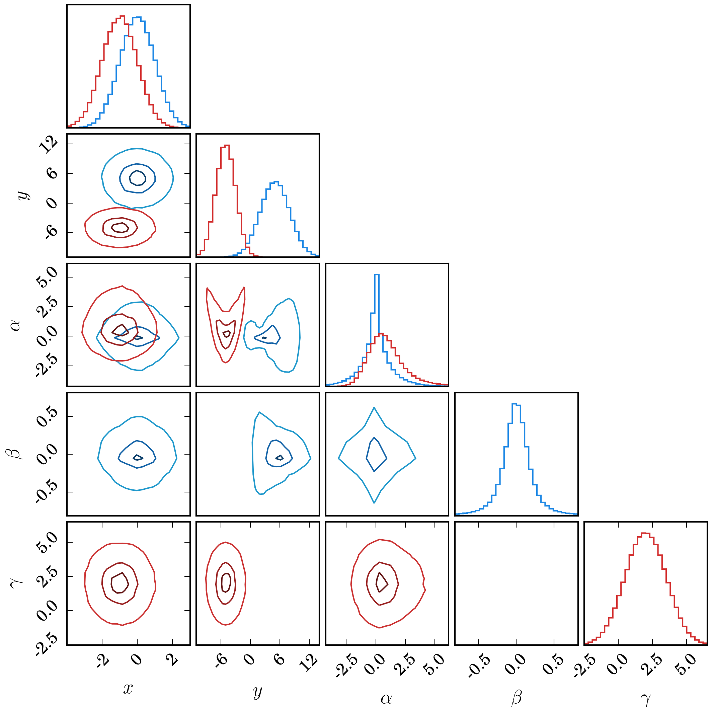

Three Datasets
--------------

Running this file in python creates three random data sets, representing
three separate chains.

We create a consumer and load all three chains into it. We also supply the
parameter labels the first time we load in a chain.

.. literalinclude:: ../dessn/chain/examples/demoThreeChains.py
   :language: python

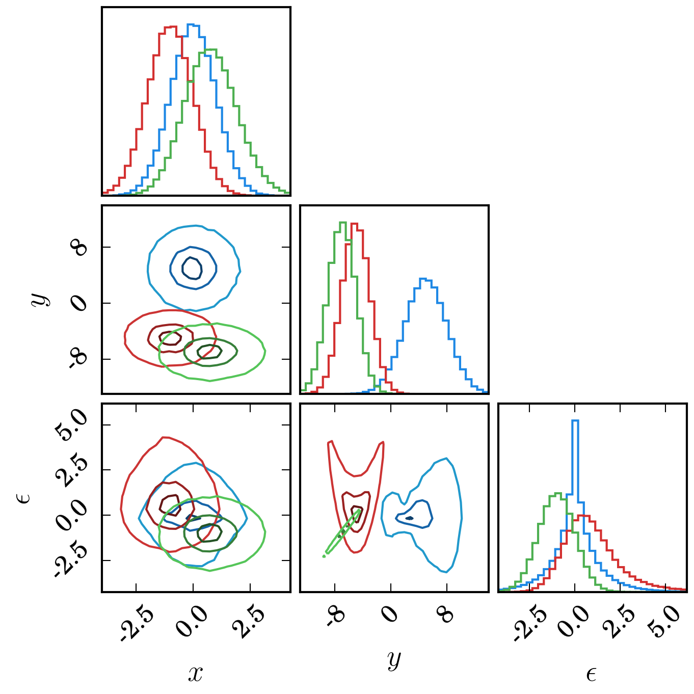

A LaTex Table
-------------

Running this file in python creates two random data sets, representing two separate chains,
*for two separate models*.

This example shows the output of calling the
:func:`~dessn.chain.chain.ChainConsumer.get_latex_table` method.

.. literalinclude:: ../dessn/chain/examples/demoThreeChains.py
   :language: python

The string output given is shown below, along with an image of the table rendered
in LaTeX.

.. code-block:: latex

    \begin{table}[]
        \centering
        \caption{The maximum likelihood results for the tested models}
        \label{tab:example}
        \begin{tabular}{cccccc}
            \hline
            Model & $x$ & $y$ & $\alpha$ & $\beta$ & $\gamma$ \\
            \hline
            Model A & $-0.04^{+1.05}_{-0.97}$ & $5.3^{+2.8}_{-3.3}$ & $-0.14^{+1.36}_{-0.98}$ & $-0.05^{+0.28}_{-0.16}$ & -- \\
            Model B & $-0.85^{+0.86}_{-1.16}$ & $-5.0^{+2.1}_{-2.0}$ & $0.3^{+1.8}_{-1.2}$ & -- & $1.9^{+1.6}_{-1.5}$ \\
            \hline
        \end{tabular}
    \end{table}

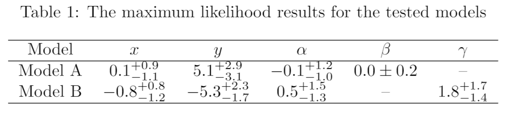

Plotting Walks
--------------

We want to see if our walks are behaving as expected, which means we should see them
scattered around the underlying truth value (or actual truth value if supplied).
This is a good consistency check, because if the burn in period (which should have
already been removed from the chain) was insufficiently long, you would expect to see tails
appear in this plot.

Because individual samples can be noisy, there is also the option to pass an integer
via parameter ``convolve``, which overplots a boxcar smoothed version of the steps,
where ``convolve`` sets the smooth window size.

Also, if you have weights for your samples, or known posteriors (which can
both be given when adding a chain), these will be plotted too!

The plot for this is saved to the png file below:

.. literalinclude:: ../dessn/chain/examples/demoWalk.py
   :language: python

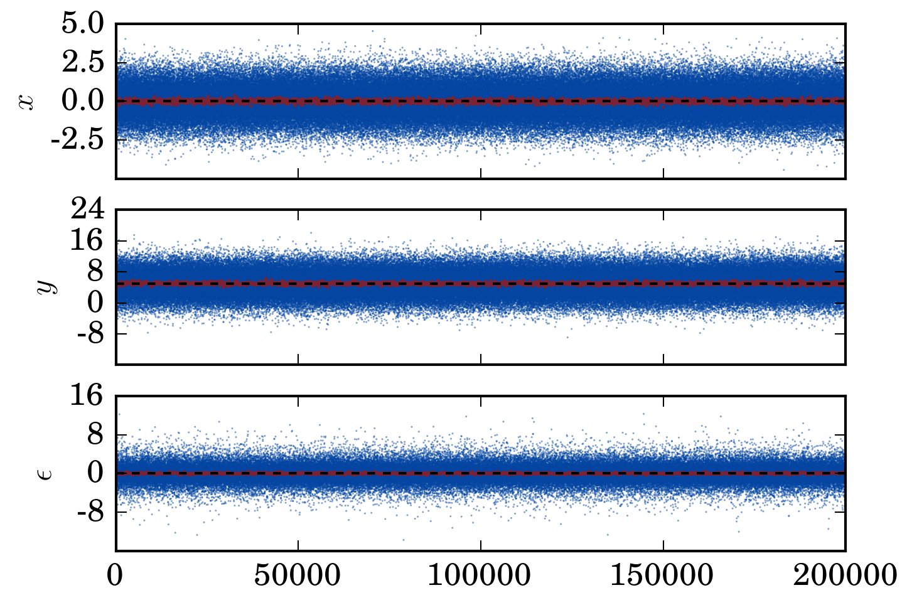

For an example in which a MH run was fit over several hundred parameters, with
weights and log posteriors recorded, this is the sort of output produces.

.. figure::     ../dessn/chain/examples/exampleWalk.png
    :align:     center

No histograms
-------------

Plot data without histogram or cloud. For those liking the minimalistic approach

.. literalinclude:: ../dessn/chain/examples/demo_various_1.py
   :language: python

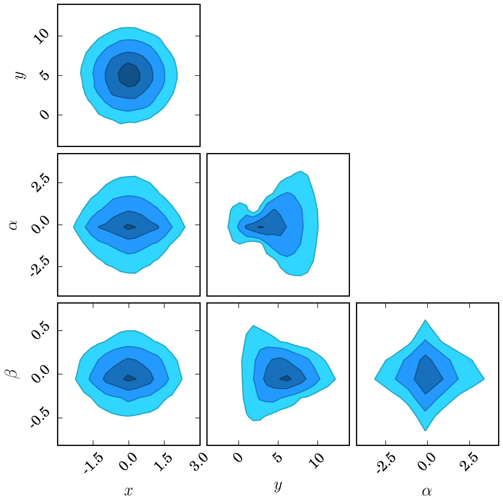

Parameter Subsets
-----------------

You can chose to only display a select number of parameters.
Here the :math:`\\beta` parameter is not displayed.

.. literalinclude:: ../dessn/chain/examples/demo_various_2.py
   :language: python

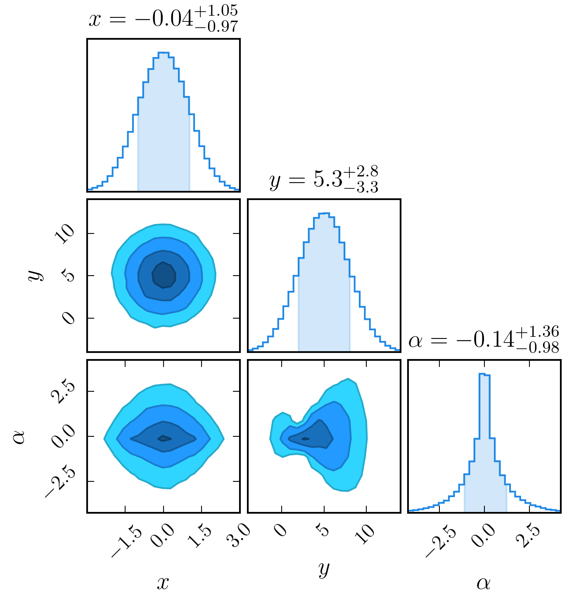

Stop Plot Flipping and Changing Ticks
-------------------------------------

When you only display two parameters and don't disable histograms, your plot will look different.

You can suppress this by passing to ``flip=False`` to :func:`ChainConsumer.configure_general`.
See the commented out line in code for the actual line to disable this.

The max number of ticks is also modified in this example.

.. literalinclude:: ../dessn/chain/examples/demo_various_3.py
   :language: python

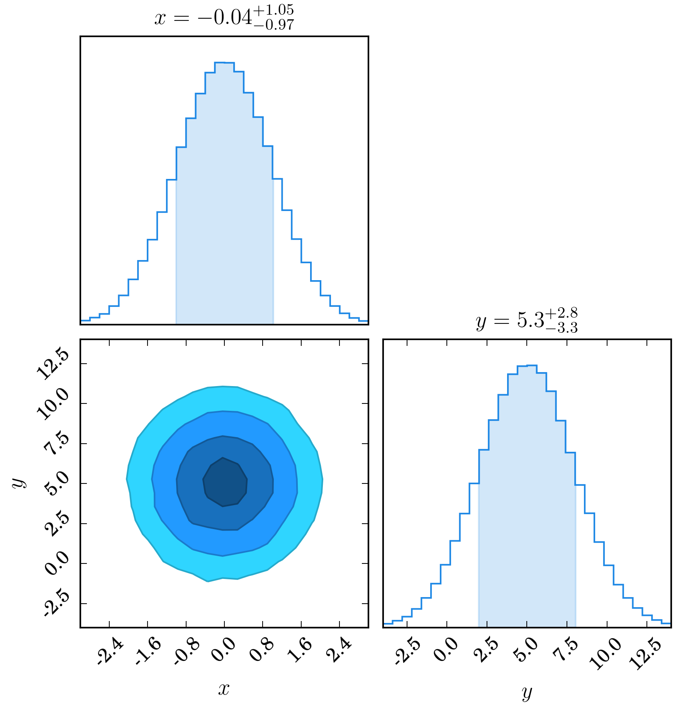

Disable Summary, Sigma Levels and Point Clouds
----------------------------------------------

If there is only one chain to analyse, and you only chose to plot a small number
of parameters, the parameter summary will be shown above the relevant axis. You
can set this to always show or always not show by using the ``summary`` flag.
Also, here we demonstrate more :math:`\sigma` levels and plotting point clouds!

.. literalinclude:: ../dessn/chain/examples/demo_various_4.py
   :language: python

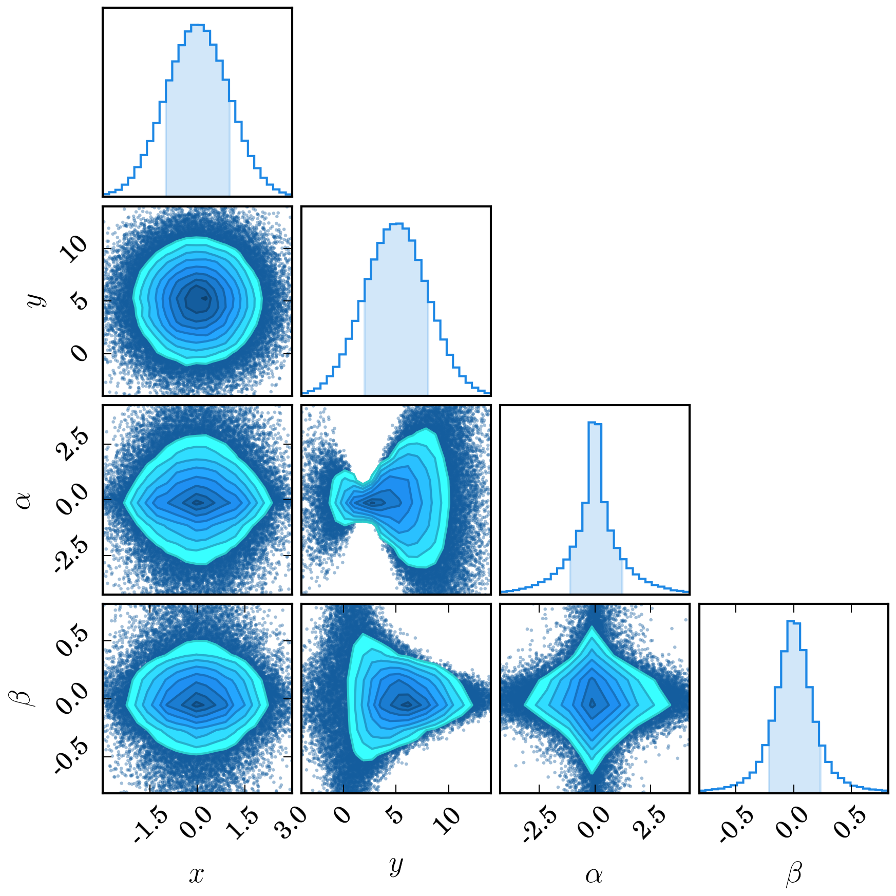

Custom Colours and Forcing Shading
----------------------------------

You can supply custom colours to the plotting. Be warned, if you have more chains
than colours, you *will* get a rainbow instead!

Note that, due to colour scaling, you **must** supply custom colours as full six
digit hex colours, such as ``#A87B20``.

As colours get scaled, it is a good idea to pick something neither too light, dark,
or saturated.

In this example, I also force contour filling and set contour filling opacity to
0.5, so we can see overlap.

.. literalinclude:: ../dessn/chain/examples/demo_various_5.py
   :language: python

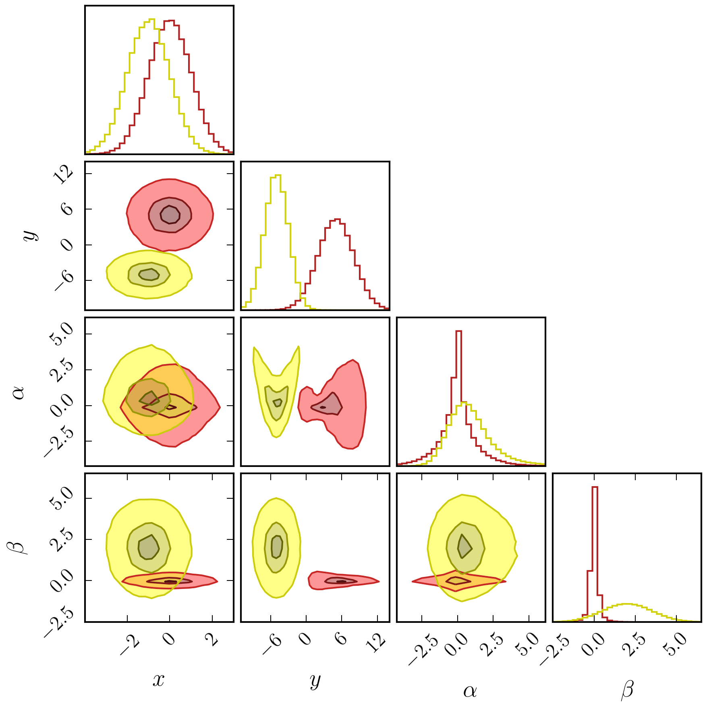

Truth Values
------------

The reward for scrolling down so far, the first customised argument that will be
frequently used; truth values.

Truth values can be given as a list the same length of the input parameters, or as a
dictionary, keyed by the parameters *labels*.

In the code there are two examples. The first, where a list is passed in, and the second,
where an incomplete dictionary of truth values is passed in. In the second case,
customised values for truth line plotting are used.

.. literalinclude:: ../dessn/chain/examples/demo_various_6.py
   :language: python

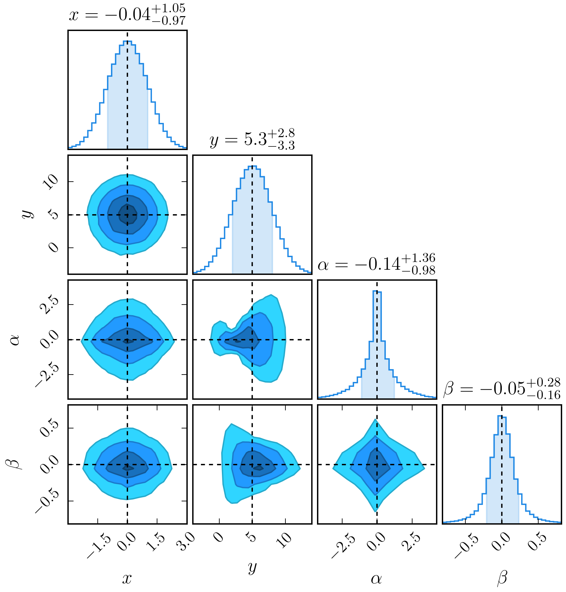

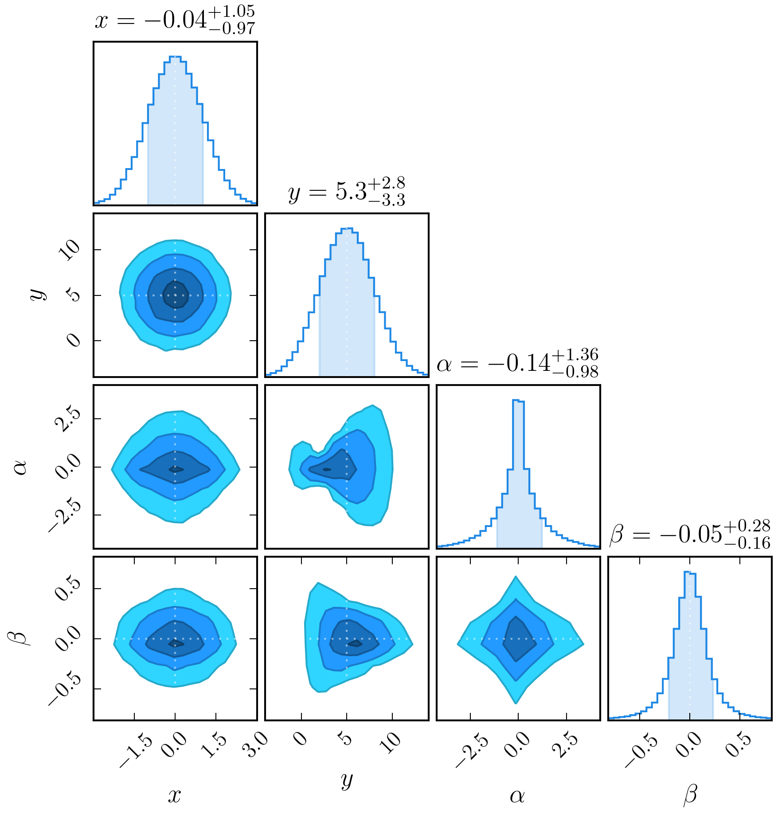

Custom bins and Sans Serif Font
-------------------------------

An example on using the rainbow with sans-serif fonts and too many bins!

.. literalinclude:: ../dessn/chain/examples/demo_various_7.py
   :language: python

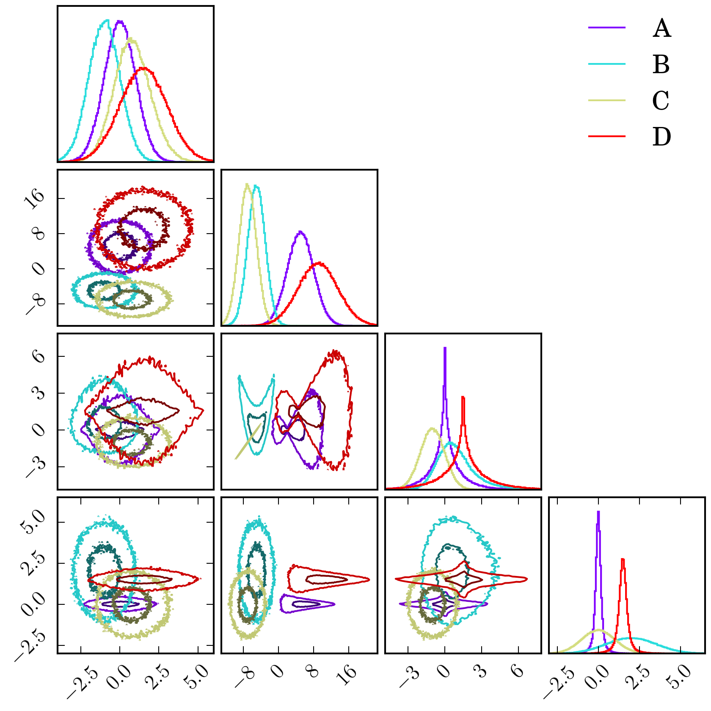

Custom Extents
--------------

An example on using customised extents. Similarly to the example for truth values in
the previous example you can pass a list in, or a dictionary.

Also modifying the number of bins using a float value to scale, rather than set, the number
of bins.

.. literalinclude:: ../dessn/chain/examples/demo_various_8.py
   :language: python

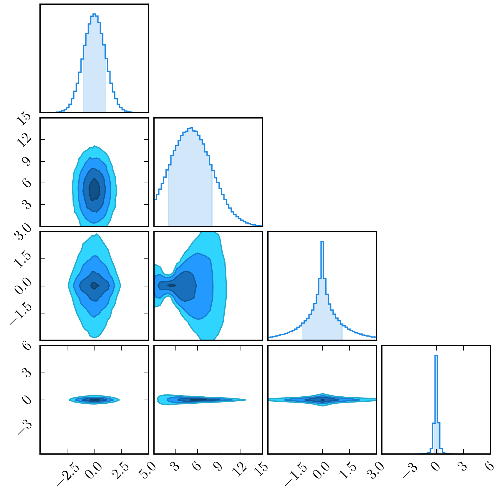

Gaussian KDE
------------

If your distribution is Gaussian-like, you may want to utilise
a Gaussian KDE on your marginalised distributions. To turn on KDEs, pass
in `kde = True` to the `configure_general` method.

KDEs are recommended to get the most accurate point of maximum
probability in your marginalised posterior, however due to their
computationally intensive nature they are by default disabled.

.. literalinclude:: ../dessn/chain/examples/demo_various_9.py
   :language: python

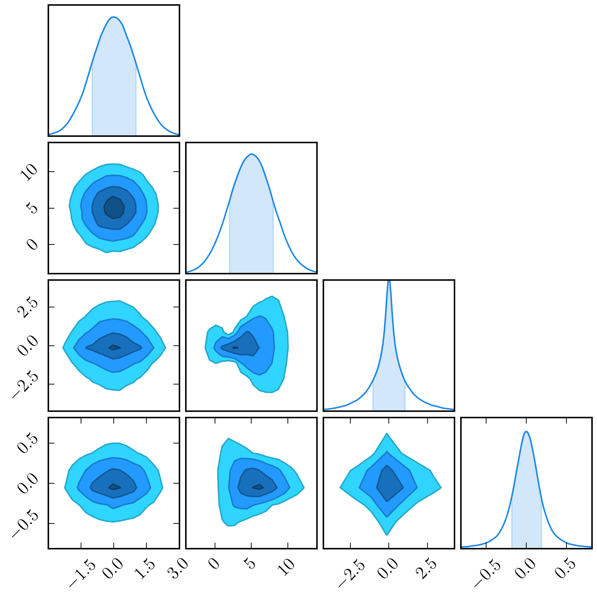
