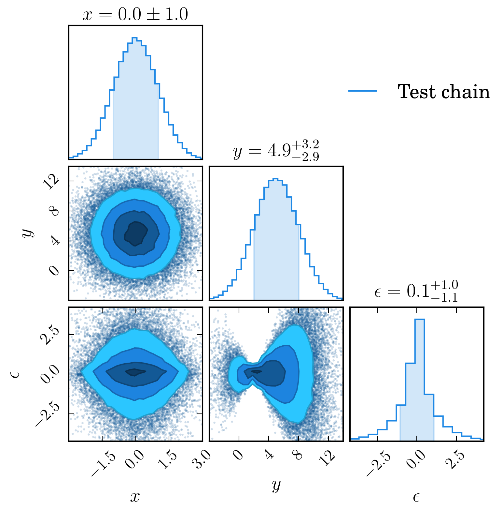
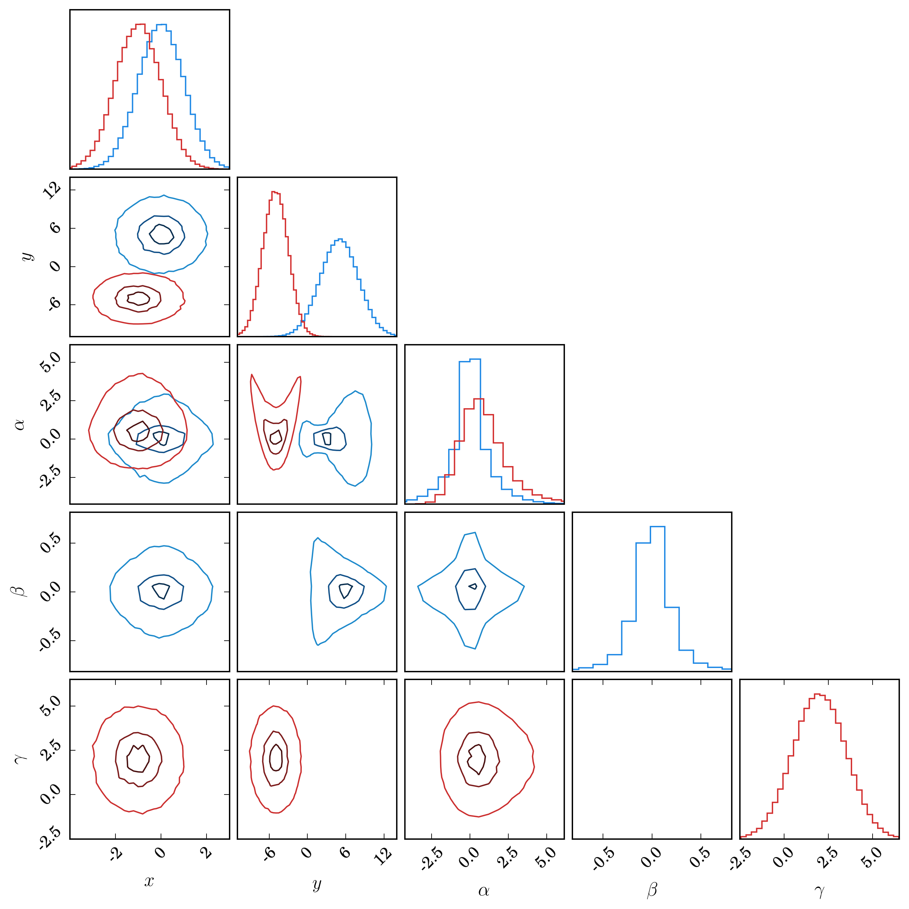
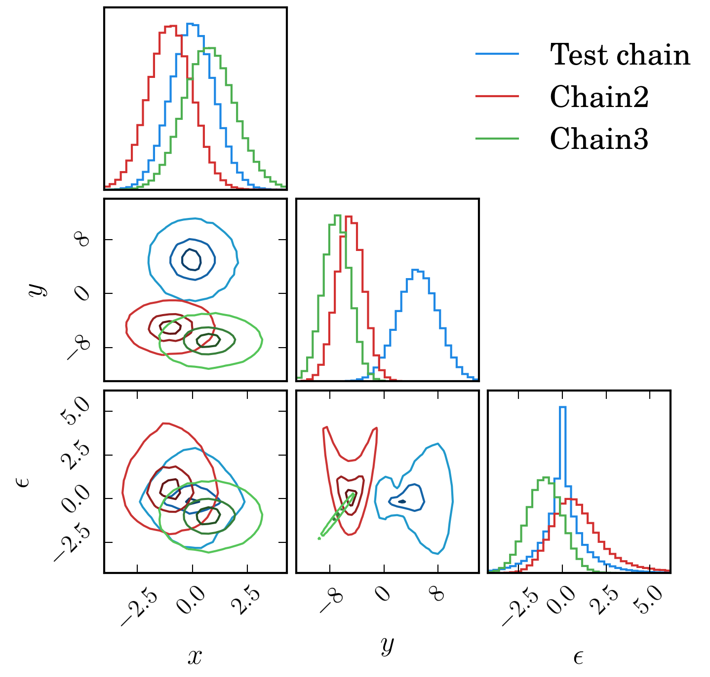

.. _chain_examples:

=======================
Chain Consumer Examples
=======================

Single Chain Example
--------------------

Running this file in python creates a random data set, representing a single MCMC chain,
such as you might get from ``emcee``.

The first thing we do is create a consumer, and load the chain into it.

We also supply the parameter labels. By default, as we only have a single chain,
contours are filled, the marginalised histograms are shaded, the best fit
parameter bounds are shown as axis titles, and the legend is not displayed.

.. literalinclude:: ../dessn/chain/demoOneChain.py
   :language: python

Two Disjoint Chains Example
---------------------------

Running this file in python creates two random data sets, representing two separate
chains, *for two separate models*.

It is sometimes the case that we wish to compare models which have partially
overlapping parameters. For example, we might fit a framework which depends
has cosmology dependent on :math:`\Omega_m` and :math:`\Omega_\Lambda`, where we
assume :math:`w = 1`. Alternatively, we might assume flatness, and therefore
fix :math:`\Omega_\Lambda` but instead vary the equation of state :math:`w`.
The good news is, you can visualise them both at once!

As we have different parameters for each chain we supply the right parameters
for each chain. Also note that we set ``display=True`` when plotting,
so the plot will also pop up if any backend is enabled.

.. literalinclude:: ../dessn/chain/demoTwoDisjointChains.py
   :language: python

Three Datasets
--------------

Running this file in python creates three random data sets, representing
three separate chains.

We create a consumer and load all three chains into it. We also supply the
parameter labels the first time we load in a chain.

.. literalinclude:: ../dessn/chain/demoThreeChains.py
   :language: python

A LaTex Table
-------------

Running this file in python creates two random data sets, representing two separate chains,
*for two separate models*.

This example shows the output of calling the
:func:`~dessn.chain.chain.ChainConsumer.get_latex_table` method.

.. literalinclude:: ../dessn/chain/demoThreeChains.py
   :language: python

The string output given is shown below, along with an image of the table rendered
in LaTeX.

.. code-block:: latex

    \begin{table}[]
        \centering
        \caption{The maximum likelihood results for the tested models}
        \label{tab:example}
        \begin{tabular}{cccccc}
            \hline
            Model & $x$ & $y$ & $\alpha$ & $\beta$ & $\gamma$ \\
            \hline
            Model A & $-0.04^{+1.05}_{-0.97}$ & $5.3^{+2.8}_{-3.3}$ & $-0.14^{+1.36}_{-0.98}$ & $-0.05^{+0.28}_{-0.16}$ & -- \\
            Model B & $-0.85^{+0.86}_{-1.16}$ & $-5.0^{+2.1}_{-2.0}$ & $0.3^{+1.8}_{-1.2}$ & -- & $1.9^{+1.6}_{-1.5}$ \\
            \hline
        \end{tabular}
    \end{table}

.. figure::     ../dessn/chain/demoTable.png
    :align:     center

