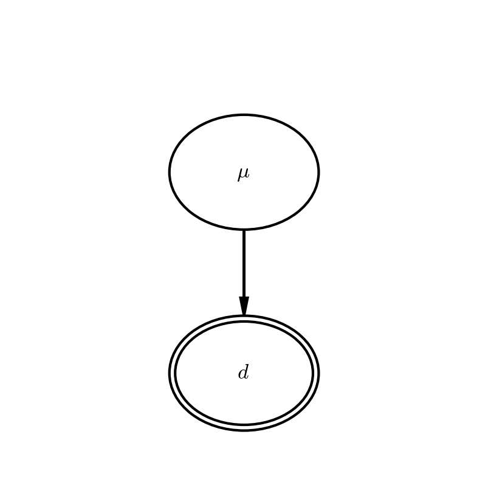
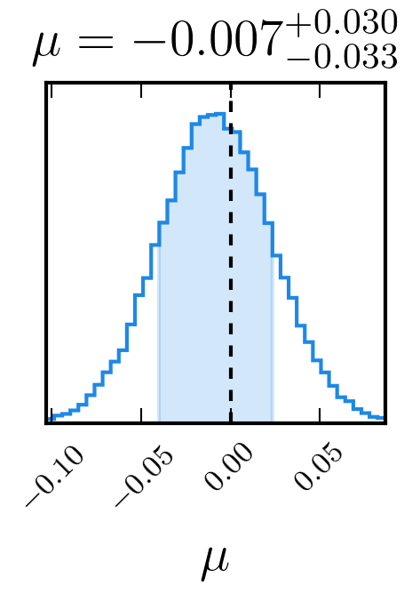

.. _core:

==================
Core Functionality
==================


Introduction
------------


Models are best thought of in this framework in terms of their PGM - their
probabilistic graphical model. In a PGM, **parameters** in your model
are represented as **nodes**, and the dependencies between parameters (the
conditional probabilities between them) form the **edges** between them.

In case you haven't checked out the :ref:`examples` section, I will put
one more concrete example here.  If you have visited the examples page,
feel free to skip to the `Building Blocks`_ section.

Consider a scenario where there is some underlying
normal distribution of data, at an unknown mean but with standard deviation one,
which we draw perfect realisations from. Mathematically, we can express this as

.. math::
    P(\mu|\vec{d}) \propto P(\vec{d}|\mu) P(\mu)

From this we can see we have the observed parameter :math:`\vec{d}`, the
underlying parameter :math:`\mu`, the prior on :math:`\mu`, and one conditional
probability connecting :math:`\vec{d}` and :math:`\mu`. So two parameters, and one edge.

You can see the code to implement such a model is verbose but explicit and clear.


.. literalinclude:: ../dessn/examples/trivial/trivial.py
   :language: python

This code generates both the PGM and the probability surface shown below.






Building Blocks
---------------

Given we construct our models piece by piece, it is important to know what
pieces we have available to play with.

Models
``````

There is only one model class, from which all models should inherit. For its
API, see :ref:`model_api`.

Parameters
``````````

* `Parameter <model_api.html#dessn.framework.parameter.Parameter>`_
    This is the base class used by other parameters and should not be initialised.
    Always use one of the concrete implementations. A base parameter requires
    a parameter name, a parameter label for plotting, and an optional
    parameter group, which is used to group similar parameters when creating
    a PGM of the model.
* `Parameter Observed <model_api.html#dessn.framework.parameter.ParameterObserved>`_
    This parameter represents observed data. In addition to requiring what
    the base parameter requires, an observed parameter also requires input data.
* `Parameter Underlying: <model_api.html#dessn.framework.parameter.ParameterUnderlying>`_
    An underlying parameter is used to describe those parameter which we are
    trying to fit for. It takes the same as the base model. As underlying
    parameters have priors associated with them, they must implement a ``get_log_prior``
    method. Additionally, as they are also part of the sampling process, methods
    must be given to help generate valid parameter ranges and starting positions.
* `Parameter Transformation: <model_api.html#dessn.framework.parameter.ParameterTransformation>`_
    A transformed parameter is a parameter which is deterministically dependent on
    other parameters. As such, it is treated different in that it does not appear
    in any samplers or fitters, but instead is calculated from other parameters.
* `Parameter Latent: <model_api.html#dessn.framework.parameter.ParameterLatent>`_
    Latent parameters are parameters which will be marginalised over. They are present
    in the sampler, but not given in final results unless explicitly asked for. Typically
    a latent parameter has many realisations, for example if you have a hundred data
    points, you might also have a hundred latent parameters. As such, instances of
    this class must implement the ``get_num_latent`` method to know how many latent
    parameters to generate. Additionally, as they are also part of the sampling process,
    methods must be given to help generate valid parameter ranges and starting positions.
* `Parameter Discrete: <model_api.html#dessn.framework.parameter.ParameterDiscrete>`_
    Discrete parameters can be included in the model and are automatically marginalised
    over (to ensure that our surfaces remain continuous). To enable marginalisation,
    the ``get_discrete`` method must be implemented, which returns the discrete options.

Edges
`````
* `Edge: <model_api.html#dessn.framework.edge.Edge>`_
    An edge simply represents a conditional probability, and as such must
    implement the ``get_log_likelihood`` method.
* `Edge Transformation: <model_api.html#dessn.framework.edge.EdgeTransformation>`_
    An edge transformation is the method by which we determine what value a discrete
    parameter should take. It should override the ``get_transformation`` method,
    which returns the transformed parameter.


For examples on how to use all of these, please simply consult the given :ref:`examples`.

Contents
--------
.. toctree::
   :maxdepth: 2

   model_api
   parameter_api
   edge_api